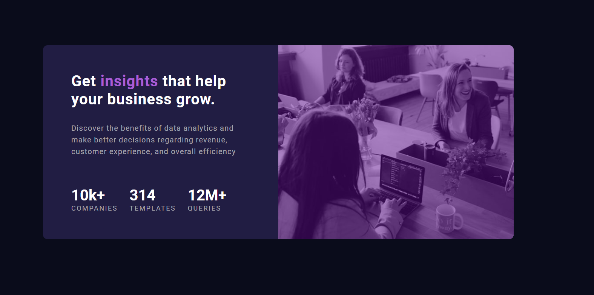
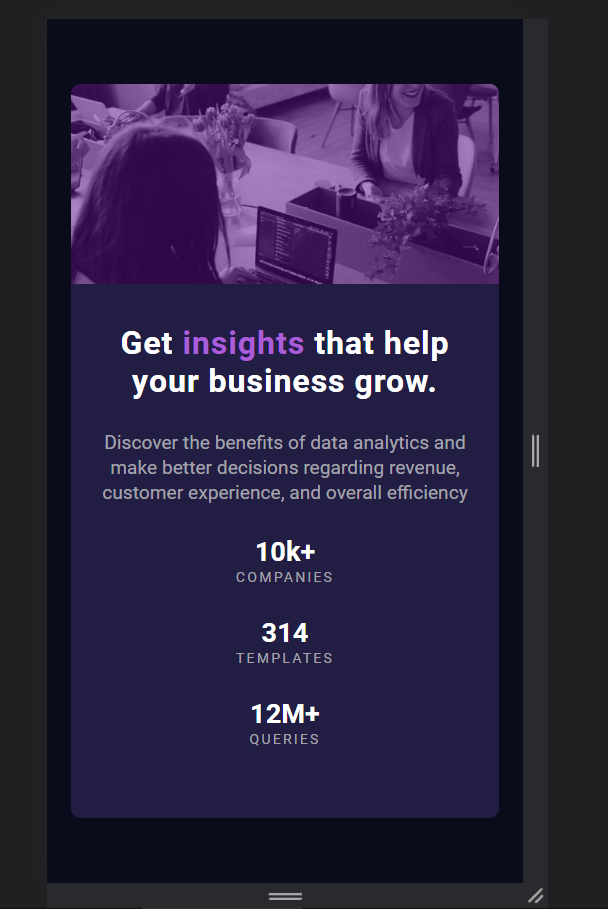

  

  

<h2>👨‍💻 Sobre o projeto</h2>

  ✅ Desafio Front-end - Componente totalmente responsivo    

<h2>🚀 Tecnologias Utilizadas</h2>

  </img>

<h2>🌐 Hospedagem</h2>

<a href="https://stats-preview-kc.netlify.app/">Acesse</a>

